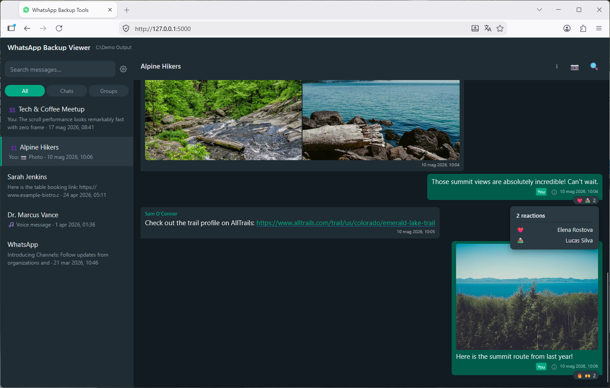
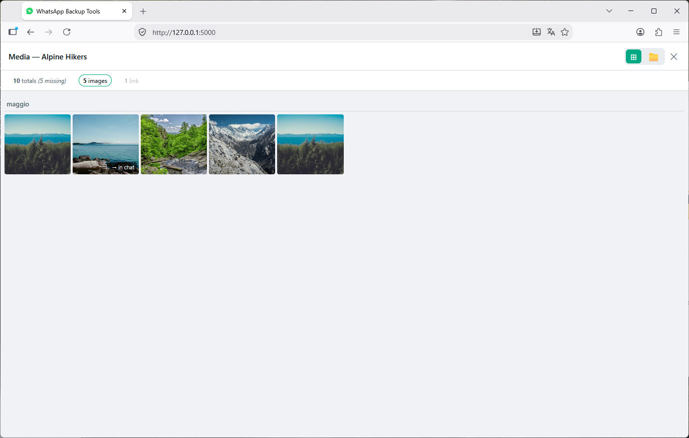

# WhatsApp Backup Tools

<p align="center">
  
</p>

## Overview

WhatsApp Backup Tools is a suite to archive and access your WhatsApp data.
Consists of two complementary programs:

- **wab-archiver** (WhatsApp Backup Archiver) organises your WhatsApp media into a structured folder hierarchy using metadata from the WhatsApp database. Instead of an unstructured dump, you get a browsable archive sorted by contact or group, year, and direction (Sent/Received), with original message timestamps preserved.
- **wab-viewer** (WhatsApp Backup Viewer) lets you browse and search your archived chats through a local web UI, replicating WhatsApp Web. 

Both tools run locally — **no data leaves your machine**. Windows, Linux, and macOS are supported. Python 3.11 required.

> ⚠️ **These tools are designed to run on a backup copy of your WhatsApp data — never on live device files.** The archiver always makes a copy of your data.


**Whatsapp Backup Viewer screenshots**
<p float="left">
  
   
</p>

---

### WhatsApp Backup Archiver Features

Organise and preserve your WhatsApp media in a clean, human-readable structure.

- **Structured & Human-Readable**: Organises media into `Contacts/` and `Groups/` sorted by year and `Sent/Received`, with original WhatsApp message timestamps preserved.
- **Smart Identity Tracking**: Automatically detects contact renames, phone number migrations, and groups with identical names across runs.
- **Safe & Incremental Runs**: Skips identical files, never overwrites existing media, merges multiple backup roots (`--wa-root`), and exports duplicate/missing media CSV audit reports.
- **Cross-Platform Support**: Works with both Android (no root required) and iOS (via iTunes backups), with optional restore mode to reconstruct Android media layouts.

#### Supported Media Types

The archiver handles: Images, Videos, Audio, Voice messages, Video Messages, Animated GIFs, and Documents.

### WhatsApp Backup Viewer Features

Explore and search your archived chats through a local web UI replicating WhatsApp Web.

- **Authentic WhatsApp Web UI**: Fast, responsive layout with dark and light themes, customizable font size, and regional date formats.
- **Rich Chat Timeline**: Chronological chat history with reactions, quoted replies, delivery/read receipts, and smooth, lag-free scrolling even in massive conversations.
- **In-Browser Media Player & Gallery**: Stream video and voice notes with seeking, open photos in a lightbox, and explore chat media via thumbnail grid or archive folder tree.
- **Full-Text Search & Navigation**: Search across all chats or within a single conversation, jump directly to matches, or jump to specific dates with the date picker.

---

## Archive Structure

After a successful run, the archive is organised as follows:

```
<output>/
├── Contacts/
│   ├── John Doe (0039123456789)/
│   │   ├── 2023/
│   │   │   ├── Received/
│   │   │   └── Sent/
│   │   └── 2024/
│   │       ├── Received/
│   │       └── Sent/
│   └── Unknown (0044987654321)/
│       └── 2022/
│           └── Received/
├── Groups/
│   ├── Family Chat/
│   │   ├── 2023/
│   │   └── 2024/
│   └── Work Team/
│       └── 2024/
├── Whatsapp Databases/       ← Extracted/decrypted WhatsApp databases (iOS & Android)
│   ├── ChatStorage.sqlite
│   ├── ContactsV2.sqlite
│   └── ...
├── .wa_media_archiver.db
├── wab-archiver.log
├── missing_media_report.csv
├── duplicate_media_report.csv
└── source_conflicts_report.csv  ← only when multiple --wa-root roots produce conflicting copies
```

- Files in **Contacts** folders retain their original filename
- Files in **Groups** folders have the sender name appended: `IMG-20230115-WA0001_JohnDoe.jpg`
- Your own sent media in groups is appended with `_Me`
- All copied files have their **modified date set to the original WhatsApp timestamp**
- Contact folder names use the `00` prefix for phone numbers (e.g. `0039...`), not `+`

---

## Quick Start

### wab-archiver quick start
Install first (see [docs/prerequisites.md](docs/prerequisites.md)):

```bash
pip install -e .
```

Always do a dry run first:

> 💡 Without `pip install -e .`, use `python -m wab_archiver` instead of `wab-archiver`.

```bash
wab-archiver archive \
  --msgstore /path/to/msgstore.db \
  --wa-root /path/to/WhatsApp/storage \
  --output /path/to/output \
  --contacts /path/to/wa_contacts \
  --dry-run
```

> 💡 On Windows, replace `\` with `` ` `` (PowerShell) or `^` (cmd.exe).

> 💡 Repeat `--wa-root` to search multiple media folders and automatically select the best copy of each file.

See [docs/archiver/](docs/archiver/) for full setup instructions and command reference.

### wab-viewer quick start

First, run wab-archiver to create the archive. Then:

```bash
pip install flask
wab-viewer /path/to/archive
```

> 💡 Without `pip install -e .`, use `python -m wab_viewer` instead of `wab-viewer`.

Opens in your browser at `http://127.0.0.1:5000`. See [docs/viewer/](docs/viewer/) for full usage.

---

## Re-running the Archiver

The archiver is **safe to re-run** on an existing archive:
- Files already copied with identical content will be **silently skipped**
- Files with the same name but different content will be **renamed with a numeric suffix** and logged as a warning
- New media not yet in the archive will be **copied normally**
- If a contact has been **renamed** since the last run, their folder on disk will be **automatically renamed** to match, keeping the archive consolidated
- Recommended: use the config file to keep settings for easier re-runs

---

## Prerequisites

- **Python 3.11** or later is required
- **Android**: End-to-end encrypted backup must be **enabled** in WhatsApp before pulling the database. Root is not required
- **iOS/iPadOS**: End-to-end encrypted backup must be **disabled**

See [docs/prerequisites.md](docs/prerequisites.md) for full setup instructions: E2E backup configuration, database extraction (Android and iOS), contacts pull, and locating your media folder.

---

## Known Limitations

### Archiver

- Stickers are not currently archived
- **Year folders reflect the local time of the machine running the script**, not UTC. A message sent just after midnight on 1 January will be filed under the new year only if your machine's clock agrees. This is intentional — the archive reflects your local experience of when media was shared
- **iOS restore mode is not supported.** Restore mode reconstructs the Android `Media/` folder layout, which has no equivalent on iOS. Running `wab-archiver restore` on an iOS archive exits with a clear error
- **iOS number change tracking is best-effort.** Contacts present in the device address book are consolidated automatically. Contacts not saved to the address book appear as separate folders
- **iOS HD media deduplication requires `ExtChatDatabase.sqlite`.** On modern iOS backups (v2.24+), the archiver extracts `ExtChatDatabase.sqlite` and automatically filters low-quality duplicates when an HD version is present. For legacy backups where this database is absent, both versions are archived

### Viewer

See [viewer known limitations](docs/viewer/index.md#known-limitations).

---

## Credits

- Inspired by [Wa_Immich_Tagger](https://github.com/mac12m99/Wa_Immich_Tagger) by mac12m99 — provided the initial Android DB query pattern
- iOS backup reading approach inspired by [whatsapp-chat-exporter](https://github.com/KnugiHK/whatsapp-chat-exporter) by KnugiHK

---

## AI-Assisted Development

This tool was developed with the assistance of AI coding tools. Development was human-led and responsible throughout:

- All architecture and design decisions were made by the developer
- The AI received specific, detailed instructions at each step — it did not drive direction
- All generated code was reviewed by the developer before being accepted
- The tool was tested end-to-end by the developer

## Disclaimer

WhatsApp Backup Tools are not affiliated, associated, authorised, endorsed by, or in any way officially connected with WhatsApp LLC, or any of its subsidiaries or its affiliates.

The project is provided 'as is' without any express or implied warranties.
